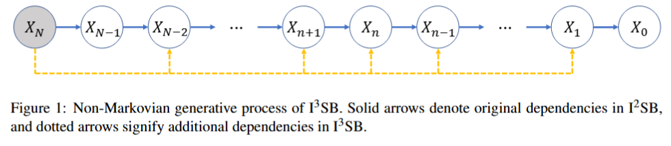

# Implicit Image-to-Image Schrödinger Bridge for Image Restoration (Pattern Recognition)



Official PyTorch implementation of the paper [Implicit Image-to-Image Schrödinger Bridge for Image Restoration](https://www.sciencedirect.com/science/article/abs/pii/S0031320325002870). Code modified from [I2SB](https://github.com/NVlabs/I2SB) and [CDDB](https://github.com/hyungjin-chung/CDDB).

## Getting started

The pre-trained checkpoints and dependencies all follow [I2SB](https://github.com/NVlabs/I2SB). Please consult the original source. We list the steps to make the repository self-contained.

### Installation
```
conda env create --file requirements.yaml
conda activate i3sb
```

### pre-trained checkpoints
One can download the checkpoints by simply running
```
bash scripts/download_checkpoint.sh $DEG_NAME
```
In this work, we consider ```$DEG_NAME```: ```sr4x-bicubic, jpeg-10```, but others can be used. One can also [manually](https://drive.google.com/drive/folders/1sgHF2FjgsAiV7doBeeOiBD8NyQhKutsG) download the model weights and place it under ```./results/{$DEG_NAME}```

## Running I3SB

Simply run
```
chmod +x ./scripts/sample.sh
./scripts/sample.sh
```
Use ```use-i3sb``` flag to run I3SB. Without this flag, I2SB sampling will be performed.

Also, make sure that ```--dataset-dir``` specified matches the paths specified in ```./dataset/val_faster_imagefolder_10k_fn.txt``` and ```./dataset/val_Faster_imagefolder_10k_label.txt```. If not, modify the txt file.

## Citation

If you find this work interesting, please consider citing
```
@article{wang2025implicit,
  title={Implicit Image-to-Image Schr{\"o}dinger Bridge for image restoration},
  author={Wang, Yuang and Yoon, Siyeop and Jin, Pengfei and Tivnan, Matthew and Song, Sifan and Chen, Zhennong and Hu, Rui and Zhang, Li and Li, Quanzheng and Chen, Zhiqiang and others},
  journal={Pattern Recognition},
  pages={111627},
  year={2025},
  publisher={Elsevier}
}
```